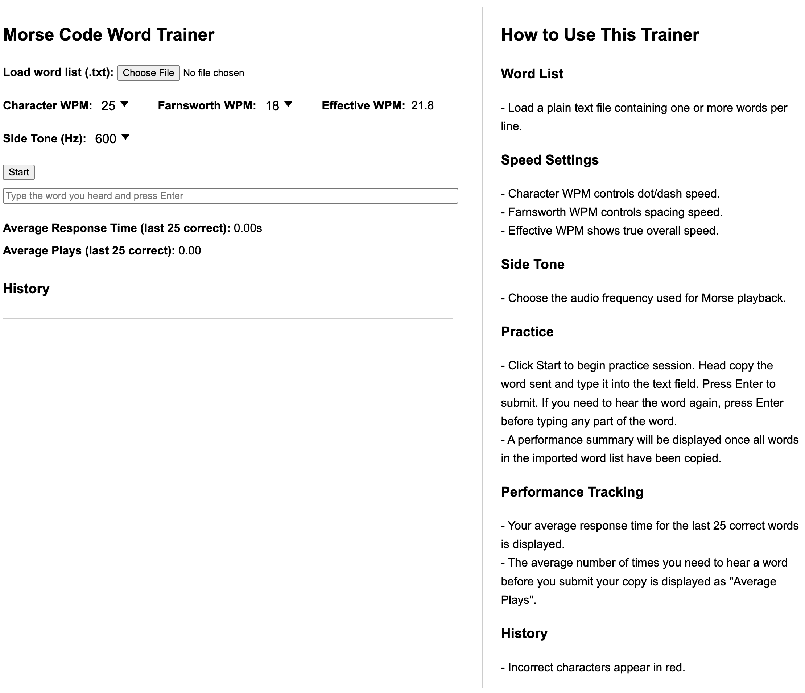

Simple Morse Code Copy Trainer using JavaScript. Download the HTML file, run it locally in your browser.

Revision History
17 June 2026 - 0.7 beta - initial commit

Description
This application is written in Javascript and HTML and provides a training platform that runs entirely within a web browser.
The app imports a user-selected text file which contains words (one per line) which are played as Morse code by the app over the computer's speakers.
The user attempts to headcopy the word and submits the word the copied for verification by the app. Whether the word was copied correctly or not,
the app will log the attempt, showing miss-copied characters in red font color.

Once all words from the imported list have been played, a session summary is provided informing the user how well they did.
